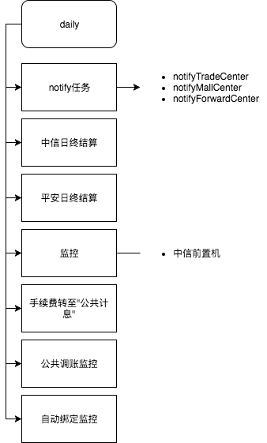
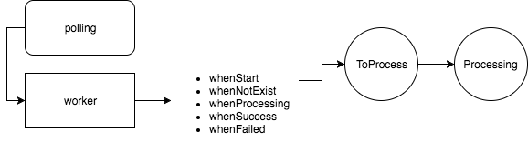

paycenter
===

---

目录结构
===

```
.
├── bank
│   ├── common
│   │   └── common.go
│   ├── ecitic
│   │   ├── ecitic.go
│   │   ├── protocol
│   │   │   └── protocol.go
│   │   ├── service
│   │   │   └── service.go
│   │   └── transfer
│   │       └── transfer.go
│   └── pingan
│       ├── common
│       │   └── common.go
│       ├── pingan.go
│       ├── protocol
│       │   ├── biz.go
│       │   ├── header.go
│       │   └── method.go
│       ├── service
│       │   └── service.go
│       └── transfer
│           ├── backward.go
│           └── forward.go
├── common
│   ├── cache
│   │   ├── bindverify.go
│   │   ├── common.go
│   │   └── sms.go
│   ├── config
│   │   └── config.go
│   ├── db
│   │   ├── common.go
│   │   ├── insertion.go
│   │   ├── modification.go
│   │   ├── queryinfo.go
│   │   ├── querylist.go
│   │   └── queryother.go
│   ├── model
│   │   ├── consts.go
│   │   ├── db.go
│   │   ├── function.go
│   │   └── other.go
│   ├── notify
│   │   ├── email
│   │   │   ├── common.go
│   │   │   ├── email.go
│   │   │   └── protocol.go
│   │   ├── notify.go
│   │   ├── sms
│   │   │   ├── common.go
│   │   │   ├── protocol.go
│   │   │   └── sms.go
│   │   └── wechat
│   │       ├── common.go
│   │       └── wechat.go
│   ├── payerror
│   │   └── payerror.go
│   ├── request
│   │   └── request.go
│   ├── response
│   │   └── response.go
│   ├── rpc
│   │   ├── action.go
│   │   └── common.go
│   ├── systatus
│   │   └── systatus.go
│   ├── translimit
│   │   ├── check.go
│   │   └── limit.go
│   └── util
│       ├── encoding
│       │   └── encoding.go
│       ├── excel
│       │   └── xlsx.go
│       ├── fee
│       │   └── fee.go
│       ├── param
│       │   ├── param.go
│       │   └── validate.go
│       ├── serialno
│       │   └── serialno.go
│       └── util.go
├── daily
│   ├── common.go
│   ├── ecitic_adjustwatcher.go
│   ├── ecitic_autobindwatcher.go
│   ├── ecitic_banksrvmonitor.go
│   ├── ecitic_feetransfer.go
│   ├── ecitic_interest.go
│   ├── settle_common.go
│   ├── settle_ecitic.go
│   ├── settle_pingan.go
│   └── transtatus.go
├── paycenter
│   ├── default.cfg
│   ├── handler_admin.go
│   ├── handler_callback.go
│   ├── handler_inner.go
│   ├── handler_public.go
│   ├── handler_user.go
│   ├── handler_util.go
│   ├── main.go
│   ├── perm.go
│   ├── route.go
│   ├── routeinner.go
│   ├── routeother.go
│   ├── routeouter.go
│   └── vendor
│       └── vendor.json
├── paycenter.dot
├── paycenter.png
├── polling
│   ├── common.go
│   ├── dispatcher.go
│   ├── ecitic_adjust.go
│   ├── ecitic_adjustback.go
│   ├── ecitic_autobind.go
│   ├── ecitic_dpayment.go
│   ├── ecitic_freeze.go
│   ├── ecitic_hpayment.go
│   ├── ecitic_hrefund.go
│   ├── ecitic_interest.go
│   ├── ecitic_payment.go
│   ├── ecitic_transfer.go
│   ├── ecitic_unfreeze.go
│   ├── ecitic_unfreezepay.go
│   ├── ecitic_withdraw.go
│   ├── ecitic_withdrawfee.go
│   ├── excuter_ecitic.go
│   ├── excuter_pingan.go
│   ├── pingan_deposit.go
│   ├── pingan_depositdown.go
│   ├── pingan_dpayment.go
│   ├── pingan_freeze.go
│   ├── pingan_unfreeze.go
│   ├── pingan_unfreezepay.go
│   ├── pingan_withdraw.go
│   ├── pingan_withdrawdown.go
│   ├── register.go
│   └── taskreader.go
└── service
    ├── account.go
    ├── bindaccount.go
    ├── daily.go
    ├── fee.go
    ├── flow.go
    ├── maintain.go
    ├── polling.go
    ├── receipt.go
    ├── sysdata.go
    └── transaction.go
```

---

main包
===
```
├── paycenter
│   ├── default.cfg
│   ├── handler_admin.go
│   ├── handler_callback.go
│   ├── handler_inner.go
│   ├── handler_public.go
│   ├── handler_user.go
│   ├── handler_util.go
│   ├── main.go
│   ├── perm.go
│   ├── route.go
│   ├── routeinner.go
│   ├── routeother.go
│   ├── routeouter.go
│   └── vendor
│       └── vendor.json
```

+++

* `handler_xxx.go`: router对应的直接handler
* main包主要是gin server，daily.Run, polling.Run

---

daily包
===



---

polling包
===



